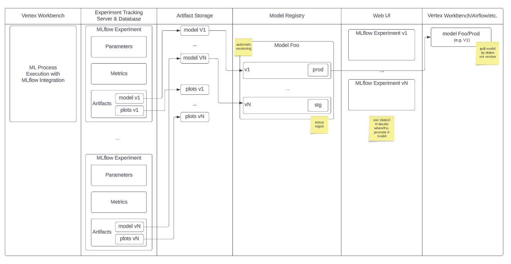
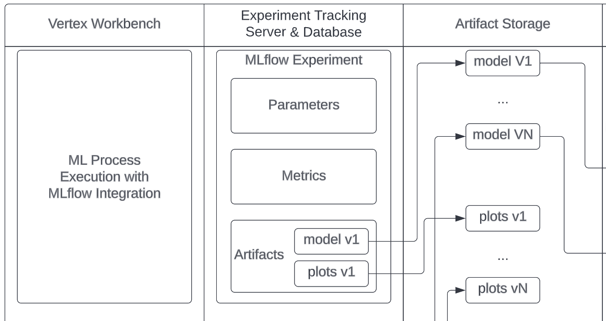
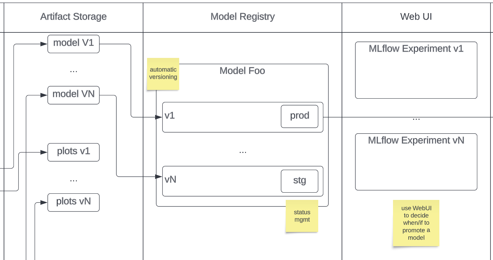
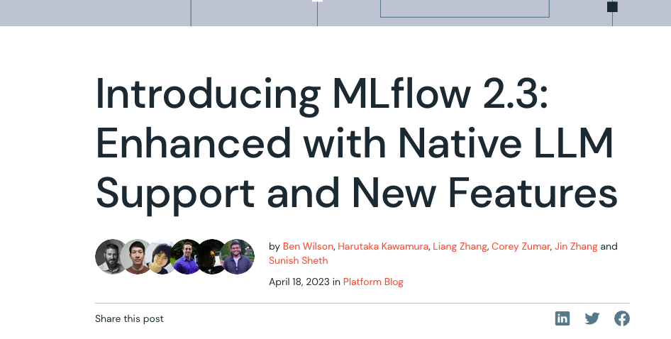

## MLflow


## ML-Ops


## MLflow



## MLflow Overview

- **Tracking**: Logs and queries machine learning experiments, including parameters, metrics, and artifacts.
- **Projects**: Packages code in a reusable, reproducible format, defining the environment and the steps to run.
- **Models**: Standardizes the format for exchanging models between various tools, keeping track of which model was used in each experiment.
- **Registry**: Acts as a central model store to share, version, and manage machine learning models.

## MLflow Overview

We'll focus on Experiment Tracking and Model Registry as the most useful to our workflow.

## Experiment Tracking with MLflow

### Why?

- **Reproducibility**: Facilitates the replication and understanding of experiments.
- **Collaboration**: Allows team members to build upon each other's work.
- **Insight and Analysis**: Provides data-driven insights into model performance.

## Experiment Tracking with MLflow

### How?

- MLflow tracks experiments through "runs", which log parameters (algorithm inputs), metrics (performance measures), and artifacts (output files in any format).
- Each run, an execution of ml/data science code, has its own parameters, metrics, and artifacts and is part of a larger experiment.

## Experiment Tracking with MLflow



### A Subtlety

The model is serialized at this phase, not in interacting with the model registry.

## Experiment Tracking with MLflow

### Demo


## Experiment Tracking with MLflow

### Demo

- `mlflow-demo-training.ipynb`
- `mlflow-demo-analysis.ipynb`

## Model Registry with MLflow



## Model Registry with MLflow

**Model Registry**: A centralized repository to manage ML models providing a systematic process to collaborate, manage, and deploy models.

Need for Model Registry: With numerous models and their versions being continuously developed, a model registry is essential to manage versions, track performance and serve as a single source of truth.

- *Model versions*: MLflow Model Registry stores versions of each registered model, keeping track of various metrics, parameters, and artifacts for each version.
- *Model stages*: In MLflow Model Registry, each model version can be assigned to stages like "Staging", "Production", or "Archived", denoting their lifecycle stage.

## Model Registry with MLflow

### Demo: Model Registry in MLflow

- `mlflow-demo-training-best-practice.ipynb`
- `mlflow-demo-load-model.ipynb`

### A Best Practice

```
# register the model at the moment of logging
mlflow.sklearn.log_model(
  model,
  "model",
  registered_model_name=experiment_name
)
```

### Promote the Best Model

## Model Registry with MLflow

### Model Flavors

In MLflow, a "flavor" is a particular way that a model can be saved and loaded. Each flavor defines a convention for certain filesystem formats and Python functions to save and load models. For instance, a model can be saved as a TensorFlow model or as a PyTorch model, and these would correspond to different flavors.

The benefit of this system is that different types of models can be managed through the same API and even be converted from one flavor to another.

```
import mlflow.sklearn
import mlflow.pytorch

model_uri = "models:/my_model/Sklearn"
sklearn_model = mlflow.sklearn.load_model(model_uri)

model_uri = "models:/my_model/PyTorch"
pytorch_model = mlflow.pytorch.load_model(model_uri)
```

## Model Registry with MLflow

### Now with OpenAI and LangChain Support!!



https://www.databricks.com/blog/2023/04/18/introducing-mlflow-23-enhanced-native-llm-support-and-new-features.html


## Integration of MLflow with Existing Systems

- Using MLflow can be as simple as the following:

```
import mlflow

mlflow.set_tracking_uri('http://localhost:5000/')
mlflow.set_experiment("PENGUINS")

with mlflow.start_run():

    # ml code
    mlflow.log_params(params_dict)
    mlflow.log_param("param_1", value)
    mlflow.log_metric("accuracy", accuracy)
    mlflow.sklearn.log_model(
      model,
      "model",
      registered_model_name=experiment_name
    )
    mlflow.log_artifact(f"{model_name}_{params}.png")
    # png or json, text, etc
```

## Integration of MLflow with Existing Systems

### A Subtlety

The ml code and its execution is independent of the mlflow execution context. While the time spent "in content" is automatically logged,
it is perfectly fine to run code outside of the context and use it only for logging.

### A Recommendation

Mlflow is a well-written package and should be used "by convention" rather than "by configuration". Thin wrappers are not necessary and 
may actually complicate things. 

Rather, just make effective use of `mlflow.set_tracking_uri` and `mlflow.set_experiment`.

## Q&A

- Open for questions
